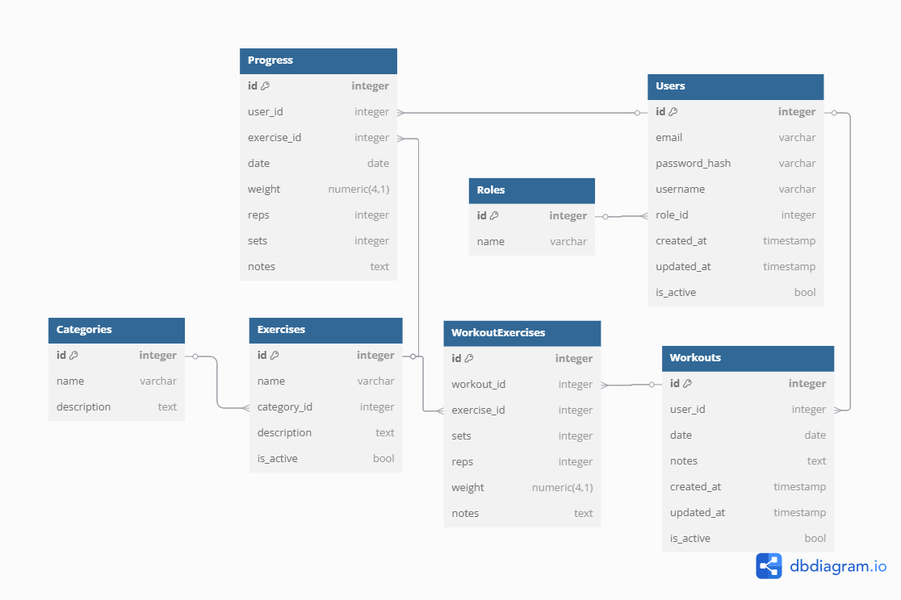

# Отчет 2: Проектирование базы данных и api  

## 1. Тип базы данных  

В качестве СУБД выбрана **PostgreSQL**, так как она обеспечивает надежность, масштабируемость и поддержку транзакций. Взаимодействие с БД реализуется с использованием **чистого sql (database/sql)** без orm для повышения производительности и контроля над запросами.  

## 2. Схема БД

### Структура БД включает следующие основные сущности:  

- **Users** – хранит информацию о пользователях  
- **Workouts** – содержит данные о тренировках пользователей  
- **Exercises** – справочник упражнений  
- **WorkoutExercises** – связь между тренировками и упражнениями, хранит информацию о повторениях, подходах и весах  
- **Progress** – отслеживание прогресса пользователя по конкретным упражнениям  

### ER-диаграмма  

## 3. Описание REST API

### Список эндпоинтов
- /api/v1/auth – аутентификация
- /api/v1/exercises – управление упражнениями
- /api/v1/workouts – управление тренировками
- /api/v1/progress – отслеживание прогресса

Swagger-документация доступна по пути /api/v1/swagger/index.html.

### Формат запросов и ответов
Формат запросов и ответов – JSON.

### Аутентификация и авторизация
Для защиты API используется JWT-аутентификация.

## 4. Базовая структура проекта на Go

### Подключение к БД

[db.go](../backend/internal/db/db.go)

### Модели

[models](../backend/internal/models)

### CRUD для Exercises

[exercise.go](../backend/internal/handlers/exercise.go)

